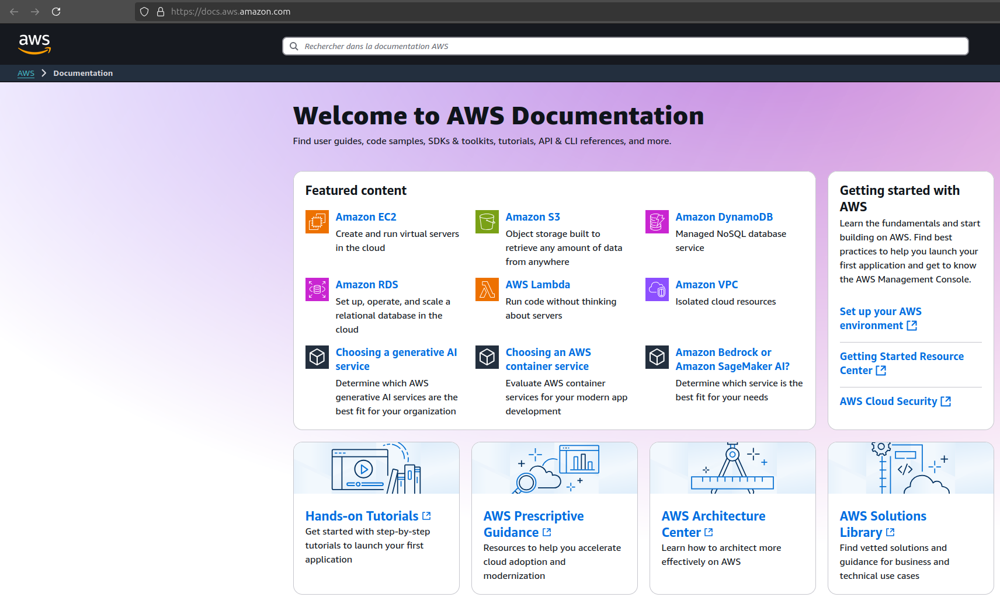
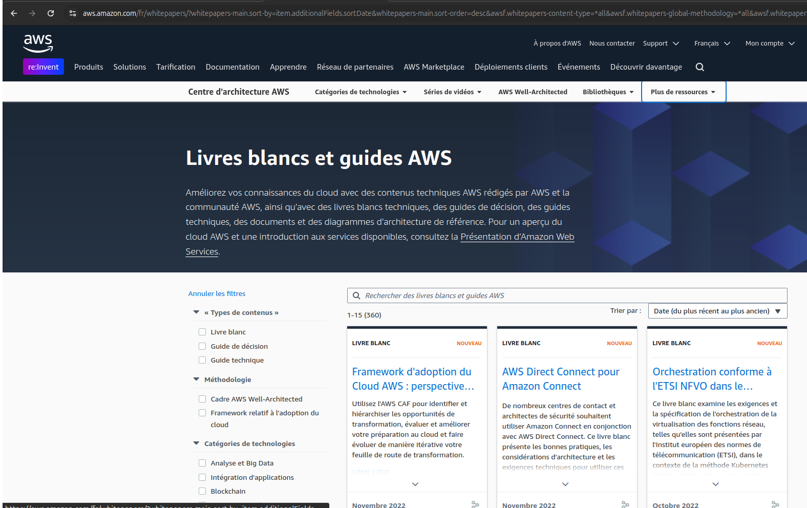

---

tags:
  - aws

---

# La documentation AWS

## Le portail

Le portail de documentation AWS est complet et traite de chacun des services. Les traductions ne sont pas toujours faite ni parfaite, si vous êtes à l'aise en anglais n'hésitez pas à configurer le portail en anglais.

Les documentations sont généralement complètes et exchaustive donc ce n'est pas évident au début de s'y retrouver, quand vous commencez avec un nouveau service n'hésitez pas à commencer sur les sections **getting started**, puis de reprendre la documentation en fonction de vos points d'intérêt.

## Les livres blanc

Les livres blancs contiennent des lectures, au dela de la documentation, qui vont vous permettre d'acquérir les bonne pratiques avec AWS.

Voici une liste de livres intéressant à lire quand on commence avec le cloud AWS :

- [Présentation AWS](https://docs.aws.amazon.com/whitepapers/latest/aws-overview/introduction.html)
- [Hébergement web et AWS](https://docs.aws.amazon.com/whitepapers/latest/web-application-hosting-best-practices/welcome.html)
- [Tarification AWS](https://docs.aws.amazon.com/whitepapers/latest/how-aws-pricing-works/welcome.html)