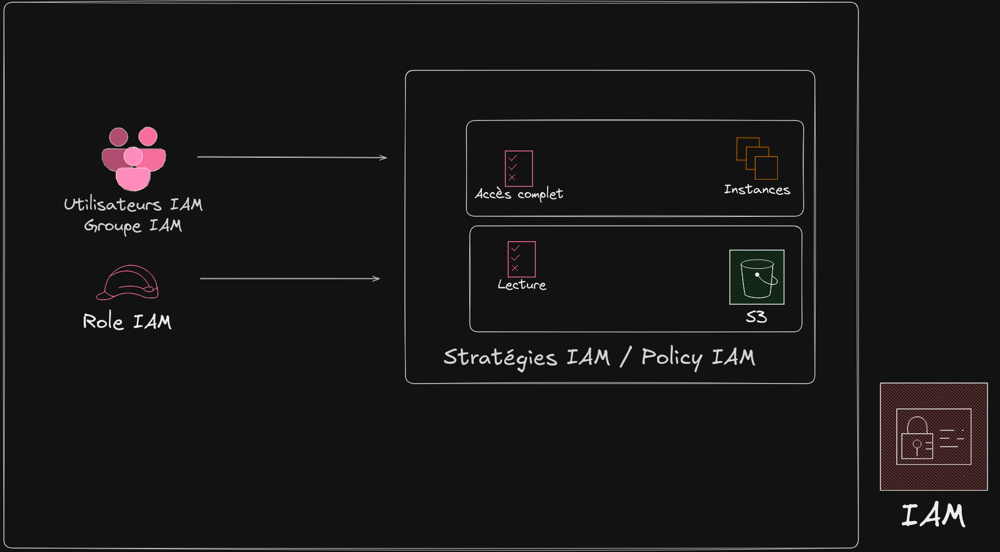
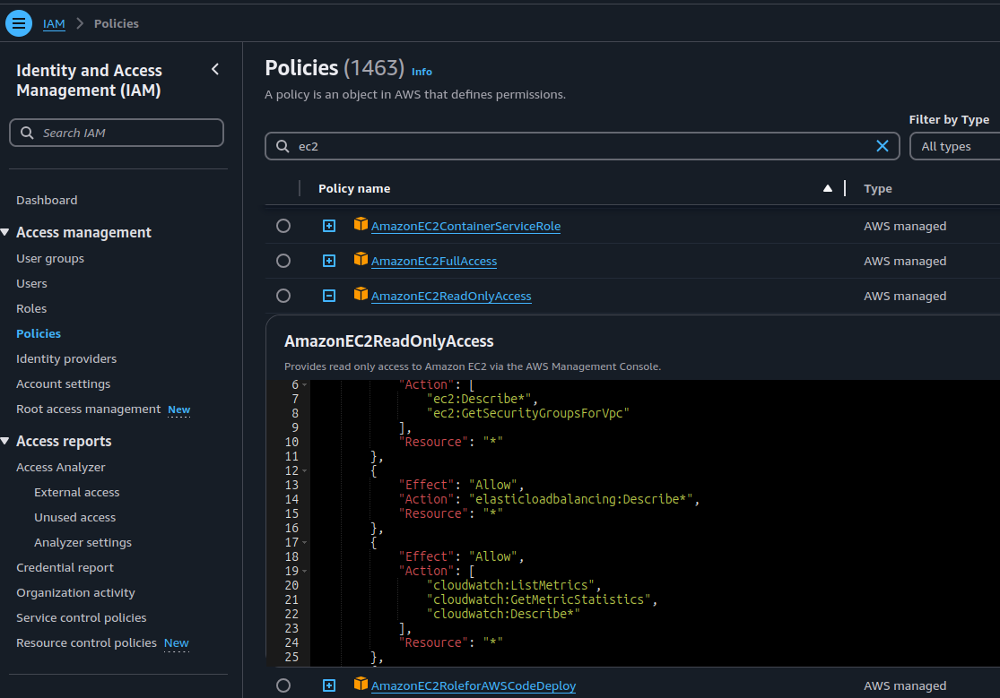
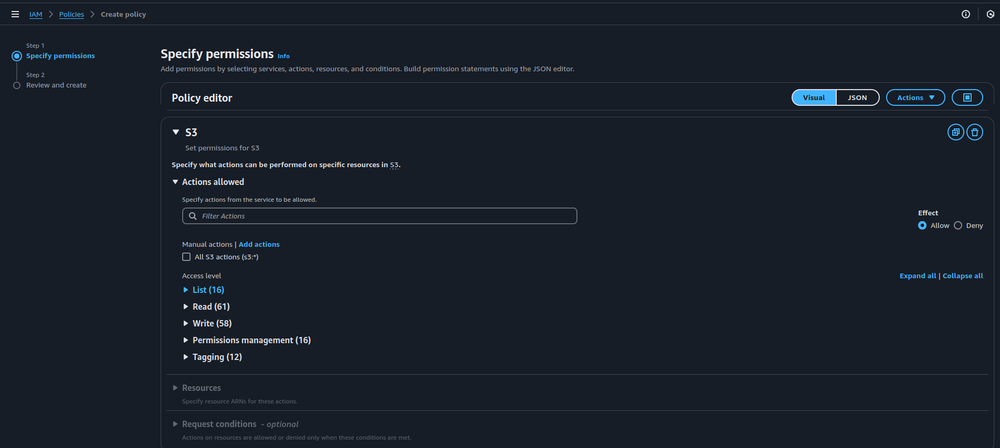

---

tags:
  - AWS
  - IAM

---

# La gestion des identité et des accès avec IAM

**IAM** (**I**dentity and **A**ccess **M**anagement) est un service AWS dédié à la gestion des accès des services et composant AWS. Il est gratuit et permet une gestion très fine des permissions et accès associé à chaque ressource AWS. C'est un produit phare du système AWS qui le démarque par rapport à la concurrence. Mais comme souvent avec les produits puissant il faut consacrer un peu de temps à leur apprentissage.

IAM gère l'accès à des **ressources AWS**, les ressources AWS sont des éléments concret de service AWS comme par exemple une instance EC2 (VM), un bucker S3.

Par exemple avec IAM on pourra définir qui peut démarrer ou stopper une instance EC2 en particulier.

Les points de contrôles sont les suivants :

- **Qui** peut accéder à la ressource (personne, entité logicielle)
- **Quelles ressources** sont accessibles et que peut faire l'utilisateur avec ces ressources
- **Par quelle méthode** les ressources sont accessibles

## Les différents composants IAM

- L'**utilisateur IAM**, une personne ou une entité applicative qui peut s'authentifier avec un compte AWS (on créé des utilisateurs spécifique à une application pour pouvoir l'autoriser).
- Le **groupe IAM**, un ensemble d'utilisateurs IAM qui reçoivent une autorisation identique.
- La **stratégie IAM** ou **policy IAM**, un document json qui définit les ressources accessibles et le niveau d'accès à chaque ressource. Exemple, le répertoire d'un dépôt S3, qui est accessible en lecture uniquement.
- Le **rôle IAM** est un peu comme un utilisateur mais s'associe directement à un service AWS, on peut par exemple associer un rôle à une ou des instances EC2, ou a une ou des distribution Cloudfront.

## Mécanisme d'autorisation

Tout d'abord on identifie qui, ce peut être un utilisateur IAM, un groupe IAM ou un rôle IAM.

Ensuite on lit la ou les stratégie(s) IAM (les policy) qui vont indiquer ce qu'on peut faire avec quoi.



## Méthode pour créer un accès

- Charger le service AWS nommé IAM
- Création de la policy (stratégie)
- Création d'un utilisateur ou d'un rôle et y affecter la ou les stratégies

Dans une même stratégie on peut affecter plusieurs contrôles de ressources différentes, mais attention à garder une logique de réutilisabilité, dans la pratique on fera généralement plusieurs petites stratégie pour affecter individuellement chaque type de ressources.

Une bonne pratique est de limiter au minimum les droits nécessaires, puis d'élargir au besoin les droits. Pour cela il suffit généralement de consulter le message d'erreur de l'application ou de l'utilisateur qui nous indiquera de manière assez précise le privilège à ajouter à notre stratégie.

## Les types de stratégie (policy)

Les policy se classent selon deux catégorie selon si elles sont attaché à un utilisateur, groupe ou rôle ou si elles sont attaché à une ressources AWS.

Les stratégies basées sur l'identité sont celles qu'on utilise le plus fréquement, voici quelques scénarios :

- Autoriser l'application frontend à lire les données sur volume S3 nommé website-static.
- L'utilisateur Toto peut supprimer une instance EC2
- Les membre du groupe Admin peuvent supprimer toutes les instances EC2
- Les instances EC2 appartenant au rôle front-cluster-s3 peuvent accéder en lecture/écriture au volume S3 website-static.

Les stratégie basées sur les ressources vont se définir dans une ressources en particuler et ne seront pas associé à un utilisateur / rôle. Voici quelques scénarios :

- Le bucket S3 website-static autorise la distribution cloudfront en lecture à ses données et autoriser le listing.
- Le bucket S3 autoriser l'utilisateur toto à accéder à ses données en lecture et écriture (mauvaise pratique).

Les stratégies basées sur les ressources ne sont prise en charge que par certains service AWS.

## La stratégie IAM

### Utiliser des stratégies déjà faite

Il existe plein de stratégies/policy intégrée nativement dans AWS que vous pouvez réutiliser pour vos besoin, donc avant d'écrire votre propre stratégie, commencez par chercher quelque chose qui conviendrait à votre besoin. Dans notre cas par exemple on souhaite autoriser une application à lister et consulter l'état de nos VM's EC2, on va donc chercher ce qui pourrait convenir, AmazonEC2ReadOnlyAccess semble convenir parfaitement :



### Ecrire sa propre stratégie

C'est un document json assez complexe à écrire from scratch mais qui peut être écrit en utilisant la GUI :



La création consiste en deux étapes, identifier les ressources à contrôler et donner des droits à chaque ressources identifiées.

Voici un exemple de policy pour l'accès à un bucket s3 :

```json
{
    "Version": "2012-10-17",
    "Statement": [
        {
            "Sid": "VisualEditor0",
            "Effect": "Allow",
            "Action": [
                "s3:PutObject",
                "s3:GetObject",
                "s3:ListBucket",
                "s3:DeleteObject",
                "s3:GetBucketLocation"
            ],
            "Resource": [
                "arn:aws:s3:::latelier-s3",
                "arn:aws:s3:::latelier-s3/*"
            ]
        }
    ]
}
```
