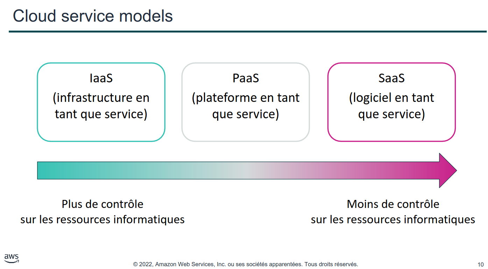
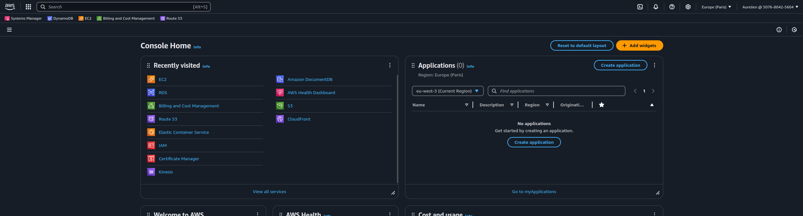

---

tags:
  - AWS

---

# Introduction à AWS

AWS est le cloud provider associé à Amazon, AWS pour Amazon Web Service.

Leur modèle de Cloud se définit par plusieurs éléments :

- la possibilité d'exécuter des services à la demande,
- d'être tarifé à l'utilisation,
- de transformer tout ce qui est matériel en services gérés logiciellement.

En découle directement ses avantages :

- flexibilité,
- évolution rapide et moins chères,
- supprimer les actions manuelles.

Ainsi une startup démarrera avec 0 investissement dans l'infrastructure et son coût augmentera ou diminura en fonction de son activité et donc de son chiffre d'affaire.

## Les différents type de service cloud

On peut séparer les services cloud en 3 catégories :

- IaaS : Infrastructure as a Service (EC2, S3, VPC), ce sont des service d'infrastructure qu'il faut configurer, par exemple avec Terraform
- PaaS : Platform as a Service (Lambda, RDS, Fargate, EKS), des plateformes prêt à l'emploi pour développer et déployer des applications
- SaaS : Service as a Service (Amazon Workspaces, AWS AppStream), des services à utiliser directement dans son navigateur par exemple.

Chaque niveau apporte une couche d'abstraction et de service, SaaS fonctionne sur du PaaS qui fonctionne à son tour sur du IaaS.

## Le déploiement des services Cloud

Si les service Cloud sont là pour nous cacher l'aspect matériel, il reste tout de même une réalité de déploiement, chacun des services est bien déployé quelque part dans des datacenters sur des serveurs.

On peut catégoriser ces déploiements en 3 modes :

- **cloud** ce qui est généralement le cas partout 
- **Sur site** (Cloud privé) l'entreprise déploie toute l'infrastructure cloud sur ses sites, peut être le cas de gros groupes ou entreprises ayant les moyens de le développer (EDF, Orange, etc). Ce peut aussi être des obligations sécuritaire pour des groupes comme Thales, Dassault.
- **hybride** Conserver certaines données sensible physiquement tout en s'appuyant sur la souplesse des services Cloud, c'est généralement ce qui est adopté dans le cas de Cloud privé.

## Mutualisation et économie

AWS mutualise les ressources entre ses clients ce qui lui donne la possibilité de faire des économies d'échelle importants.

Pour se représenter la mutualisation des ressources, imaginez un gros serveur qu'on acheterait pour toute la promotion et qui couterai 100€/mois, si on installait dessus un système de virtualisation, alors on pourrait donner à chaque étudiant une VM et ne lui faire payer que sa part du serveur.

De plus toute la partie ingénierie associé à la mise et en place de l'outil de virtualisation serait alors mutualisé à l'échelle de l'école : chaque promotion pourrait bénéficier du service développé par l'école.

AWS est le premier opérateur cloud du marché, il a donc amassé à la fois beaucoup de savoir faire, de technologies et de clients : son économie d'échelle est très importante et lui permet de faire beaucoup de marge et ainsi de financer à peu prêt tous les projets qu'il souhaite. C'est principalement AWS et non pas la boutique Amazon qui finance Blue Origin.

## Travailler avec les services AWS

On peut interagir avec les services AWS par 3 moyens :

- la console web

- l'interface en ligne de commande, (AWS CLI) "le cli"
- le SDK

## Les clés du succès AWS

- La règle des [2 pizza's](https://aws.amazon.com/fr/executive-insights/content/amazon-two-pizza-team/)

## Déploiement mondial

AWS est disponible à travers le monde entier par l'intermédiaire de régions, si la zone géorgraphique Etat Unis et Europe sont les mieux représentées, il y a régions disponibles à travers le monde entier.

En france métropolitaine nous avons uniquement la région **eu-west-3** qui contient 3 zones de disponibilité : eu-west-3a, eu-west-3b et eu-west-3c. Chacune de ces zones correspondent à un datacenter (voire plusieurs).

Les tarifs AWS sont spécifiques à une zone déployée ainsi votre hébergement coutera moins cher en France qu'en Allemagne par exemple, mais coutera encore moins cher à Stokholm.

## La responsabilité partagée

il est important avant d'utiliser un service professionnellement de déterminer les champs d'action et les reponsabilité de chaque partie, certains aspects sont géré par l'hébergeur et d'autre sont géré par le client.

AWS est responsable de ses services : sécurité des datacenters, infra logicielle, matérielle et réseau, système de virtualisation et isolation des VM's.

Par contre les utilisateurs sont responsable des éléments qui sont sous leur maitrise : mise à jour des OS qu'ils ont installé, politique des firewall et des comptes IAM, gestion des mots de passe etc.
