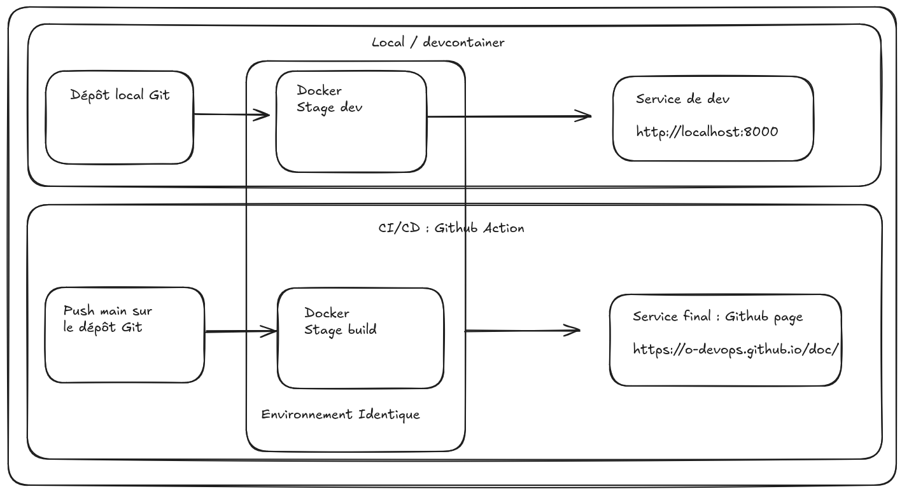

---
tags:
  - Github Action
  - Github Pages
---

# Utiliser les Github pages

Lorsque vous avez un site statique à déployer, le plus simple peut être d'utiliser les github pages, ce système permet de publier simplement des sites web directement depuis votre dépôt.

Pour que cela fonctionne il faut tout de même mettre en jeu deux mécanismes :

- upload votre site statique dans un artifact (sorte d'espace de stockage)
- activer la github page avec le contenu de votre artifact

Ces deux actions sont en réalité des actions Github action disponible dans le marketplace, il suffit donc d'écrire un workflow Github Action.


## Workflow d'exemple

```yaml
---
name: Upload de github pages

on:
  workflow_dispatch:
  push:
    branches:
      - main

jobs:
  # Build job
  build:
    runs-on: ubuntu-latest
    # <Not provided for brevity>
    # At a minimum this job should upload artifacts using actions/upload-pages-artifact
    steps:
      - name: Get data from repository
        uses: actions/checkout@v4

      - uses: actions/setup-python@v5
        with:
          python-version: '3.13'

      - run: pip install -r requirements.txt

      - name: generate static files
        run: mkdocs build

      - name: Upload static files as artifact
        id: deployment
        uses: actions/upload-pages-artifact@v3 # or specific "vX.X.X" version tag for this action
        with:
          path: site/

  # Deploy job
  deploy:
    # Add a dependency to the build job
    needs: build

    # Grant GITHUB_TOKEN the permissions required to make a Pages deployment
    permissions:
      pages: write      # to deploy to Pages
      id-token: write   # to verify the deployment originates from an appropriate source

    # Deploy to the github-pages environment
    environment:
      name: github-pages
      url: ${{ steps.deployment.outputs.page_url }}

    # Specify runner + deployment step
    runs-on: ubuntu-latest
    steps:
      - name: Deploy to GitHub Pages
        id: deployment
        uses: actions/deploy-pages@v4 # or specific "vX.X.X" version tag for this action
```

## Logique DevOps

Notre méthode de travail avec Github page permet de proposer à la fois un environnement de développement local et un environnement de déploiement en production.

Les deux environnements sont identique car ils utilisent la même image Docker et donc exactement les même dépendances.

Cependant le build de l'image Docker n'est pas commun et est fait dans des environements différents. Ca reste tolérable.

