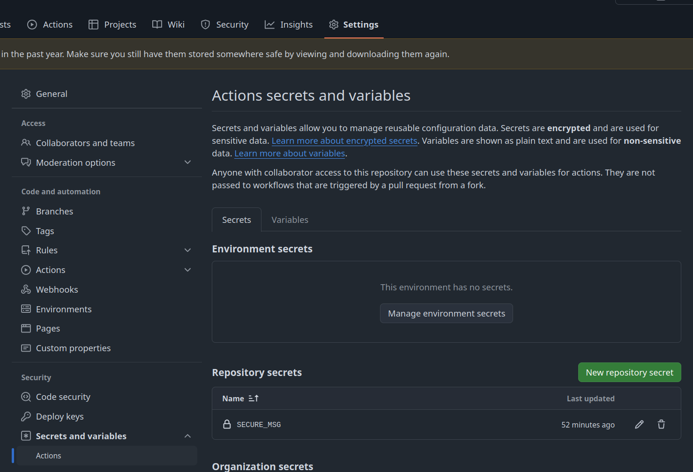
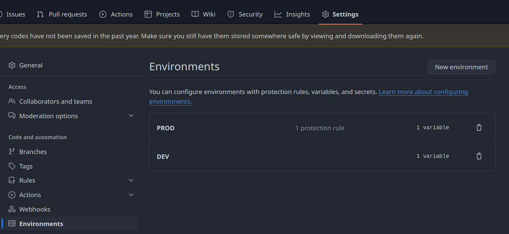
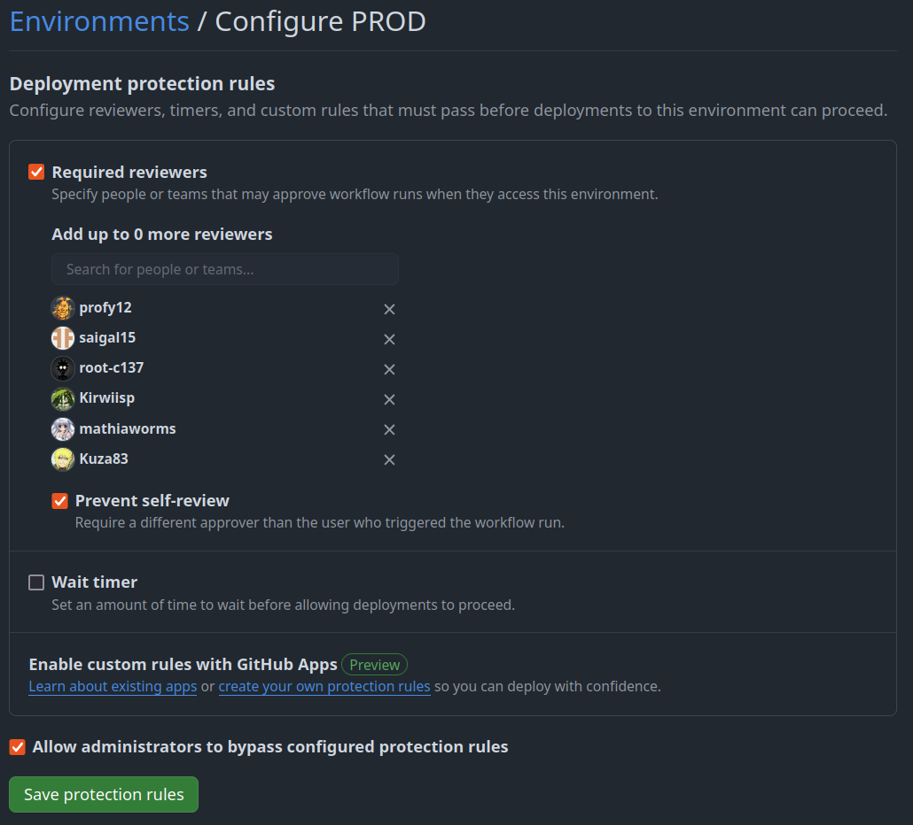

---
tags:
  - Github Action

---
# Variable et secrets dans Github Action

Github Action propose un système de gestion de variable et de secrets pour enrichir l'exécution et améliorer l'adaptabilité de vos workflows.

La définition se passe directement dans l'interface Github dans cette section :



Il y a deux onglets, un pour la gestion des secrets et l'autre pour la gestion des variables.

Les variables sont accessible dans les workflow via deux type d'appels, par exemple :

- `{{ vars.VAR1 }}` accès aux variables classique non chiffrées.
- `{{ secrets.SECRET1 }}` accès aux variable de type secrets.

Ces variables peuvent être utilisées de deux manière différentes :

- directement en argument aux actions Github via les options `with:`
- en les passant comme des variable d'environnement aux commandes sous jacentes

Ainsi la step ci dessous pourra donc afficher le contenu de la variable `MSG` :

```yaml
- run: echo $MSG
env:
    MSG: ${{ vars.MSG }}
```

## Cas pratique d'usage

Vous pouvez stocker directement le contenu d'un fichier .env de producation dans par exemple une variable qu'on nommerait `ENV`.

```env
DB_HOST=mydb.oclock.io
DB_USER=appuser
DB_PASSWORD=4g5sz6rst5h14dhrtyh5fqesr4g44
DEBUG=false
```

## Utilisation des environments

Les **environments** contextualisent les variable selon des contextes, ainsi la variable ENV dans le contexte `PROD` va donner le contenu du fichier .env pour la production et la même variable `DEV` contenir les variables du contexte de pré-production.



L'environment doit être défini au niveau du job dans le workflow :

```yaml
jobs:
  build:
    runs-on: ubuntu-24.04
    environment: PROD
    steps:
```

Généralement on aura des workflows différents pour par exemple la production et la preproduction et donc on définir l'usage de ces environnement au niveau du workflow :

Une fois l'environnement définit correctement, le contenu des variable sera subtitué par celui de l'environment sélectionné.

### Affiner le contrôle de nos workflows

Les **environments** donnent aussi la possibilité de contrôler finement l'accès au variable et de demander des review lorsqu'on accède à une variable d'un environment :



Ils peuvent aussi être limités à certaines branches et tag Git, on peut donc imaginer réserver l'utilisation de l'environment **PROD** à la branche main et donc interdire qu'un workflow un peu zelé accèdent à des secrets confidentiels.


### Exemple

Voici un exemple de [workflow](https://github.com/o-devops/ga-tests/blob/main/.github/workflows/cowsay.yml) utilisant les environments.