---
tags:
  - terraform
---

# Introduction à Terraform

Le but de Terraform est de décrire une infrastructure. Pour cela il va utiliser un ou des fichiers descriptifs.

Le fichier ou les fichiers descriptifs vont eux même décrire des ressources, qui peuvent être par exemple une instance EC2, un volume S3, mais aussi plein de ressources auxquelles on ne pensera pas au premier abord comme un dépôt Github voire même une pizza !

Les fichiers descriptifs ne sont pas écrits en Yaml comme on pourrait s'y attendre mais se basent sur un format développé par Haschicorp, le HCL.

Dans le cas de Terraform, ces fichiers HCL vont accueillir le langage Terraform qui nous permettra de décrire nos ressources.

Avec ce ou ces fichiers descriptifs Terraform va nous permettre de le déployer, ou plutôt de les synchroniser avec le provider en question, que ce soit AWS, Google Cloud Platform, Github ou même Pizzahut. Pour se donner une idée de tout ce que tout pouvons déployer avec Terraform le mieux est de consulter directement la [liste des providers Terraform](https://registry.terraform.io/browse/providers).

## Installation de Terraform

L'installation de Terraform consiste en l'installation d'un cli nommé terraform.

Vous pouvez vous référer à la [documentation officielle](https://developer.hashicorp.com/terraform/tutorials/aws-get-started/install-cli) pour l'installer directement dans votre poste de travail.

Cependant en bon DevOps que nous sommes nous allons l'installer dans un environnement reproductible pour l'ensemble des intervenants qui seront amené à travailler sur nos ressources Terraform. Pour cela nous allons utiliser Docker, vscode et les devcontainers.

### Création de l'environnement DevContainer

#### Manuellement

Dans votre répertoire de travail, créez un nouveau répertoire et initialiser votre configuration devcontainer manuellement avec le fichier .devcontainer/devcontainer.json` ci dessous :

```json
// For format details, see https://aka.ms/devcontainer.json. For config options, see the
// README at: https://github.com/devcontainers/templates/tree/main/src/ubuntu
{
	"name": "Ubuntu",
	// Or use a Dockerfile or Docker Compose file. More info: https://containers.dev/guide/dockerfile
	"image": "mcr.microsoft.com/devcontainers/base:noble",
	"features": {
		"ghcr.io/devcontainers/features/terraform:1": {
			"version": "latest",
			"tflint": "latest",
			"terragrunt": "latest"
		}
	}

	// Features to add to the dev container. More info: https://containers.dev/features.
	// "features": {},

	// Use 'forwardPorts' to make a list of ports inside the container available locally.
	// "forwardPorts": [],

	// Use 'postCreateCommand' to run commands after the container is created.
	// "postCreateCommand": "uname -a",

	// Configure tool-specific properties.
	// "customizations": {},

	// Uncomment to connect as root instead. More info: https://aka.ms/dev-containers-non-root.
	// "remoteUser": "root"
}
```

#### En utilisant vscode

Avec vscode et dans votre nouveau projet sélectionnez la palette (ctrl-shift-p) et initiez la création d'un nouveau devcontainer :

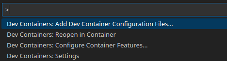

Sélectionnez `Add configuration to workspace` pour intégrer votre conf devcontainer dans le projet et partager cette configuration avec vos futurs collaborateurs.

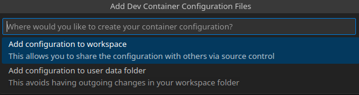

Sélectionnez votre environnement préféré, dans notre cas on utilise Ubuntu.

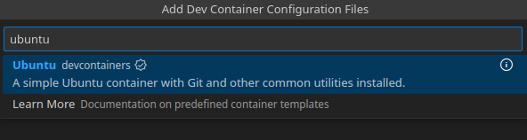

On sélectionne `noble` la dernière version LTS d'Ubuntu à l'heure actuelle.

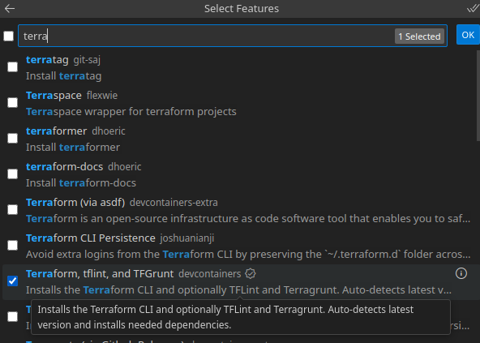

Ici on ajoute la feature pour ajouter la version officielle de Terraform pour devcontainer.

Ensuite sélectionnez les paramètre par défaut pour profiter de la dernière version (si vous déployez une production critique avec sélectionnez la dernière version pour éviter toute surprise en cas de mise à jour).

Vous n'avez plus qu'a sélectionner `Reopen in container` en bas à droite et votre terraform est installé et utilisable dans vscode.

#### Notre premier déploiement

Dans le terminal vscode (ctrl-j), vérifiez la version de Terraform :

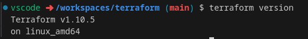

Pour tester le fonctionnement réel de Terraform au lieu d'utiliser un provider classique comme aws ou google nous allons utiliser un provider particulier, le provider **local**. Le provider local, plutôt que de déployer une configuration dans un cloud distant va nous permettre d'écrire et de gérer des fichiers locaux.

Nous allons créer un fichier nommé **main.tf** avec le contenu suivant :

```terraform
provider "local" {}

resource "local_file" "foo" {
  content  = "Hello DevOps !"
  filename = "${path.module}/devops.txt"
}
```

Nous allons maintenant devoir initialiser notre projet de déploiement avec `terraform init`

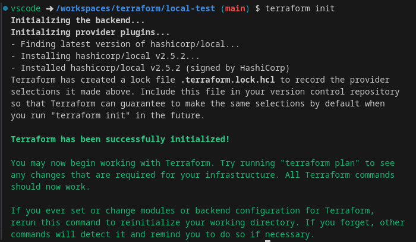

Terraform à téléchargé automatiquement le code du provider **local**, il a aussi vérouillé les dépendances dans un fichier nommé `.terraform.lock.hcl` pour figer la dépendance et s'assurer que tous vos collaborateurs utiliseront la même version du provider local, il faudra donc penser à le versionner.

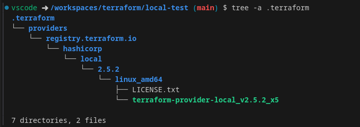

Il a aussi créé un répertoire .terraform qui contient dedans les binaires compilés pour votre architecture et qui vont prendre en charge le déploiement du provider local. Ce répertoire et spécifique à notre architecture et à notre environnement local, on ne va donc pas le versionner et on va l'ajouter à notre fichier `.gitignore`.

```bash
echo ".terraform" >> .gitignore
```

Maintenant que notre projet de déploiement est initialisé, nous allons pouvoir prévoir les changements à faire, pour cela on va utiliser la commande **plan** de terraform

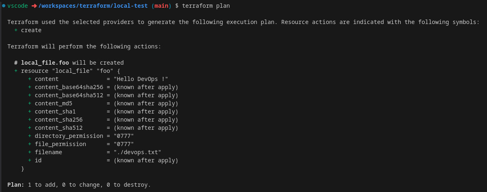

Vous avez un résumé les modifications qui seront apporté à votre infrastructure locale : création de la ressource de type local_file nommée **foo**, cette ressource va déployer un fichier nommé `devops.txt` qui contiendra le contenu `Hello DevOps !`

Nous allons maintenant appliquer réellement ces modifications avec la commande **apply**

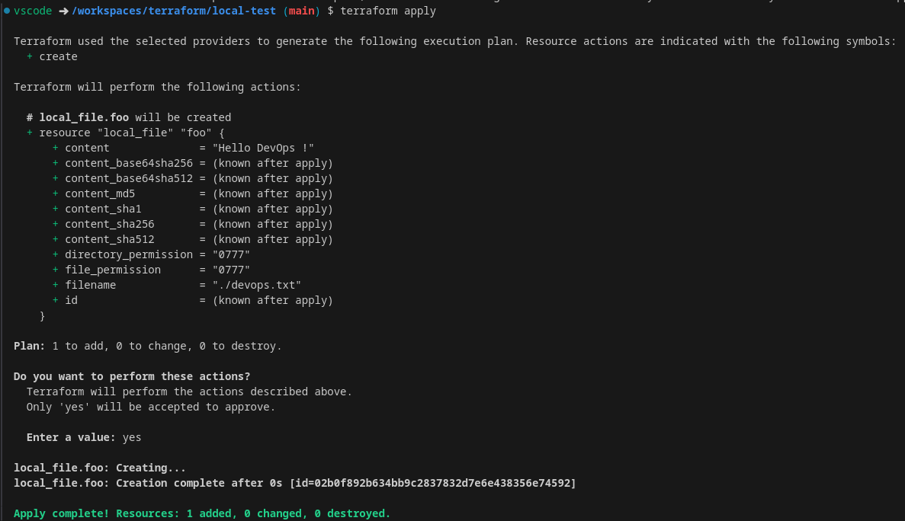

Nous avons eu un rappel du plan et une demande de validation avant de poursuivre, la ressource a été créé comme demandé, nous allons vérifier ça :

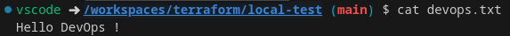

Notre déploiement a été un succès !

Mais attendez, vous n'avez rien remarqué ? Un nouveau fichier a été créé :

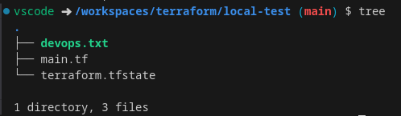

Le fichier `terraform.tfstate` a été créé automatiquement, c'est en réalité un fichier bien particulier qui permet de repérer l'état actuel du déploiement. Il est très important et on reviendra plus tard dans une section dédiée.

Bon d'accord ... tout ça pour écrire un simple fichier texte ... on pouvait difficilement faire plus compliqué.

Mais maintenant on a notre mode opératoire pour déployer des ressources sur l'ensemble des providers de Terraform et ils sont très nombreux.