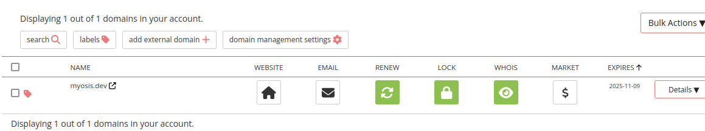
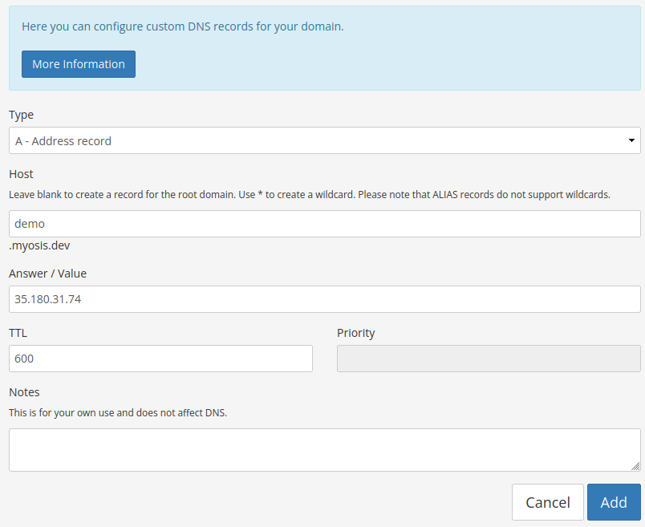
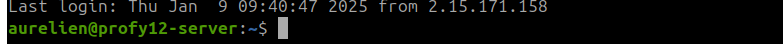
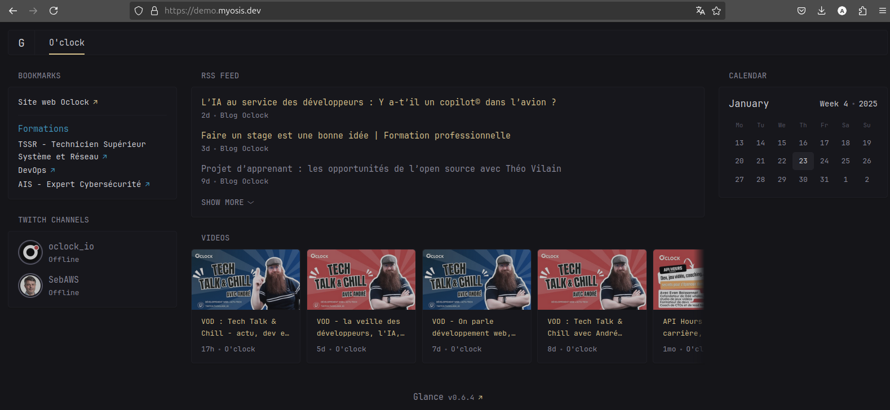

---

tags:
  - linux
  - docker
  - ssh
  - dns

hide:
  - footer
---

# Mettre en ligne un site web avec Linux et Docker

!!! note
    Ce tutoriel vous est proposé par l'équipe de l'École O'clock, vous pouvez découvrir nos formations en infrastructures, systèmes et réseaux en cliquant [ici](https://oclock.io/categorieformation/systemes-reseaux)

Dans ce tutoriel nous allons mettre en ligne un site web simple en utilisant Linux et Docker.

## Pré-requis

- Un serveur Linux disposant d'une adresse IP publique
- Un client SSH sur votre poste de travail
- Un nom de domaine

## Localiser notre serveur

Nous avons aussi besoin d'une **adresse IP** pour trouver notre serveur sur Internet, l'adresse IP est une suite de nombre qui identifie de manière unique sur le réseau Internet un ordinateur ou un serveur. Dans notre cas, le serveur Linux est identifiable via l'IP 35.180.31.74.

Mais l'adresse IP a un soucis, elle n'est pas mémorisable, qui peut retenir 35.180.31.74 et y associer de mémoire son contenu ? Personne ! Nous avons besoin d'y associer un nom mémorisable, c'est le fameux **DNS**.

Dans notre exemple nous avons acheté un nom de domaine nommé `myosis.dev` auprès du registrar [Porkbun](https://porkbun.com)



Grace a ce nom de domaine, nous allons donner un nom à notre serveur en créant dans l'interface web de notre registrar une entrée DNS `demo.myosis.dev` :



Nous pouvons maintenant vérifier avec la commande `ping` que l'association nom / ip fonctionne et que notre serveur est joignable sur Internet :

```bash
ping demo.myosis.dev
PING demo.myosis.dev (35.180.31.74): 56 data bytes
64 bytes from 35.180.31.74: seq=0 ttl=54 time=21.154 ms
64 bytes from 35.180.31.74: seq=1 ttl=54 time=21.717 ms
^C
--- demo.myosis.dev ping statistics ---
2 packets transmitted, 2 packets received, 0% packet loss
round-trip min/avg/max = 21.154/21.435/21.717 ms
```


## Connexion SSH au serveur

Pour administrer le serveur nous allons utiliser une **connexion sécurisée SSH**. Une fois établie cette connexion ouvre une ligne de commande avec notre serveur distant sur lequel on va pouvoir taper des commandes.

```bash
ssh demo.myosis.dev
```

!!! note
    dans cet exemple nous utilisons la commande ssh disponible avec n'importe quel terminal à partir du moment où vous avez installé openssh client sur votre poste de travail (powershell, terminal mac ou terminal Linux).
    Mais vous auriez aussi pu utiliser **Putty** pour lancer votre connection sans la ligne de commande.


En retour nous obtenons un prompt :



Nous pouvons maintenant interagir avec notre serveur : le paramétrer, y placer des fichiers et donc mettre en ligne notre site web.

## Installation de Docker

Avant d'installez Docker vérifiez que vous n'avez pas déjà un environnement Docker installé :

```bash
docker --version
Docker version 27.5.0, build a187fa5
```

Si vous avez ce genre de sortie et non pas une sortie comme `docker: command not found` c'est que vous avez déjà Docker et vous pouvez passer à l'étape suivante.

Il faut suivre la [documentation officielle](https://docs.docker.com/engine/install/debian/#install-using-the-repository)

Voici les instructions adaptées à notre cas, installation sur Ubuntu 22.04 :

### Installer la source de logicel officielle de Docker

```bash
# Passer en root
sudo -i
apt update
apt install ca-certificates curl
install -m 0755 -d /etc/apt/keyrings
curl -fsSL https://download.docker.com/linux/debian/gpg -o /etc/apt/keyrings/docker.asc
chmod a+r /etc/apt/keyrings/docker.asc
echo "deb [arch=amd64 signed-by=/etc/apt/keyrings/docker.asc] https://download.docker.com/linux/ubuntu jammy stable" > /etc/apt/sources.list.d/docker.list
apt update
```
### Installer Docker

```bash
apt install docker-ce docker-ce-cli containerd.io docker-buildx-plugin docker-compose-plugin
```

### Tester Docker

```bash
docker run --rm hello-world
```

## Lancer votre site web

D'abord vérifiez bien que votre VM expose bien les port tcp 80 et 443 dans la configuration du firewall de votre hébergeur, puis lancez la commande suivante :

```bash
docker run -d --cap-add=NET_ADMIN -p 80:80 -p 443:443 -p 443:443/udp \
    -v /site:/srv \
    -v caddy_data:/data \
    -v caddy_config:/config \
    caddy caddy file-server --domain demo.myosis.dev
```

Cette commande à lancé un serveur web dans un container qui a automatiquement généré un certificat SSL, le contenu du répertoire /site contient l'ensemble des fichiers web statiques nécessaires.

Testez sur [https://demo.myosis.dev](https://demo.myosis.dev)

Vous devrier avoir une page vide, il va donc falloir créer un fichier index.html vide avec notre texte :

```bash
echo "Hello world !" > /site/index.html
```

Vous avez maintenant la possibilité de déployer un site web plus élaboré en plaçant les fichiers html/css/js de votre site dans le répertoire /site/.

## Exemple de site web complet

Docker vous permet d'aller plus loin et d'installer des applications complètes tout simplement en utilisant des sortes de recettes de cuisines toutes prêtes.

Pour cela nous allons utiliser une recette nommée `compose.yml`

```yaml
services:
  caddy:
    image: caddy
    restart: unless-stopped
    command: caddy reverse-proxy --from demo.myosis.dev --to glance:8080
    cap_add:
      - NET_ADMIN
    ports:
      - "80:80"
      - "443:443"
      - "443:443/udp"
    volumes:
      - $PWD/conf:/etc/caddy
      - $PWD/site:/srv
      - caddy_data:/data
      - caddy_config:/config
    networks:
      - web
  glance:
    image: glanceapp/glance
    volumes:
      - ./glance.yml:/app/glance.yml
      - /etc/timezone:/etc/timezone:ro
      - /etc/localtime:/etc/localtime:ro
        #    ports:
        #      - 8080:8080
    restart: unless-stopped
    networks:
      - web

volumes:
  caddy_data:
  caddy_config:

networks:
  web:
```

Cette recette va lancer l'applicatif [Glance](https://github.com/glanceapp/glance) et la servir automatiquement en https en utilisant Caddy en reverse proxy.

Avant de lancer notre applicatif, nous allons le configurer dans un fichier nommé `glance.yml` :

```yaml
pages:
  - name: O'clock
    columns:
      - size: small
        widgets:
          - type: bookmarks
            groups:
              - links:
                  - title: Site web Oclock
                    url: https://oclock.io
              - title: Formations
                color: 200 50 50
                links:
                  - title: TSSR - Technicien Supérieur Système et Réseau
                    url: https://oclock.io/formations/technicien-systemes-et-reseaux
                  - title: DevOps
                    url: https://oclock.io/formations/formation-expert-devops
                  - title: AIS - Expert Cybersécurité
                    url: https://oclock.io/formations/expert-cybersecurite
              - title: Réseaux sociaux
                links:
                  - title: X
                    url: https://x.com/Oclock_io
                  - title: Instagram
                    url: https://www.instagram.com/oclock_io/
                  - title: Linkedin
                    url: https://www.linkedin.com/school/ecole-o'clock/


          - type: twitch-channels
            channels:
              - oclock_io
              - lafibredudev
              - monpetitpc
              - devgirl_
              - SebAWS

      - size: full
        widgets:
          - type: rss
            limit: 10
            collapse-after: 3
            cache: 3h
            feeds:
              - url: https://oclock.io/feed
                title: Blog Oclock


          - type: videos
            channels:
              - UCVdtXmsbmewiS6N9QjO8LKA # Oclock

      - size: small
        widgets:
          - type: calendar
```

Une fois ces deux fichiers préparés, il n'y a plus qu'a lancer notre nouveau service :

```bash
docker compose up
```

Et à tester notre nouveau service sur [https://demo.myosis.dev](https://demo.myosis.dev)

